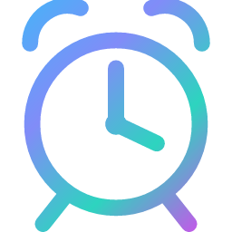
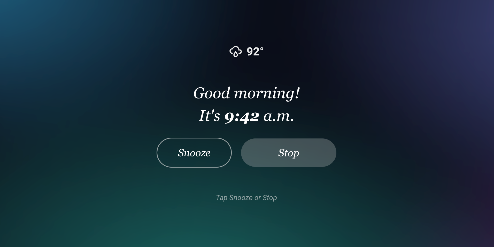
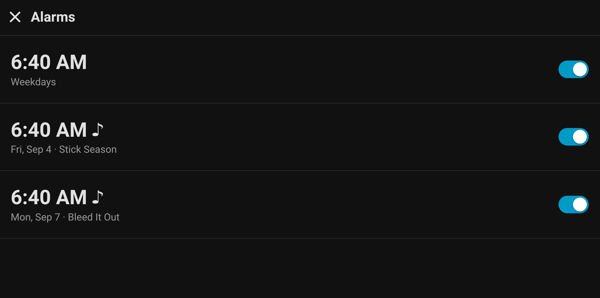
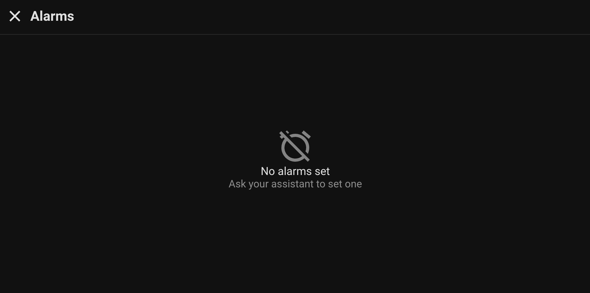

# Multi-Room Alarm Clock

[![hacs][hacs-badge]][hacs] [![HA min version][ha-badge]](https://www.home-assistant.io)

A Home Assistant integration that turns voice/display satellites into **real,
per-room alarm clocks** — Echo Show + [VACA], ESPHome Voice PE, Wyoming, any
`assist_satellite`. One shared engine. No per-room automations or scripts.

> "Set an alarm for 6:30 on weekdays" — spoken to the satellite in the bedroom —
> creates an alarm for **the bedroom**. At 6:30 it wakes that screen, ramps the
> speaker (and the device's hardware volume) up, plays the room's chosen wake
> song from Music Assistant, and keeps ringing until someone says "stop" or taps
> snooze.

---

## Screenshots

**Ringing** — takes over the room's screen when an alarm fires. Snooze / Stop,
or say it. Plain Lovelace, so it appears the instant the alarm goes off.



<table>
<tr>
<td width="50%">

**Alarm list** — one screen per room. Recurring and one-time alarms, ♪ marks a
custom wake song. Tap a row to toggle, press-and-hold to delete.



</td>
<td width="50%">

**Empty state** — alarms are created by voice ("set an alarm for 7am"), not by
tapping.



</td>
</tr>
</table>

---

## What it does

- **Per-room alarms** — recurring (`days`) or one-time (`date`, self-deleting
  after it fires).
- **One parametrised fire path.** Each room is a small record (its players,
  lights/scene, screen-wake entity, default sound + volume). An alarm only
  stores its `room` — everything else comes from the room record at fire time.
- **Rings until stopped or snoozed.** Custom wake media via Music Assistant with
  automatic fallback to a bundled tone. Forces volume on the media player(s)
  *and* the device's hardware stream volume, so a turned-down speaker can't
  sleep through it. Restores the previous volume afterward.
- **Snooze** — rounded to the minute, persisted across restarts, re-fires the
  exact media that was playing.
- **Voice** — an LLM API (`alarm_set` / `alarm_list` / `alarm_stop` /
  `alarm_snooze`) plus sentence-matched `stop` / `snooze` / `show my alarms`.
  The room is resolved from the calling device — never asked.
- **Mic-aware ring loop** — while a satellite in the ringing room is listening,
  the ring goes silent so the mic can hear "stop", then resumes.
- **Dashboard cards** — an Alexa-style full-screen ringing overlay, an alarm
  list with tap-to-toggle / hold-to-delete, and a next-alarm chip. All driven by
  the integration's entities; no per-room copies.

---

## Requirements

| | |
|---|---|
| Home Assistant | 2024.8 or newer |
| An `assist_satellite` per room | Echo Show ([VACA]), Voice PE, Wyoming, HA Voice… |
| A conversation agent with LLM support | for the voice API (any — local or cloud) |
| [Music Assistant] | optional, for custom wake songs (falls back to a tone) |
| [browser_mod] | optional, to force a room's screen to its dashboard on fire |

Dashboard cards additionally need these HACS frontend plugins: **card-mod**,
**button-card**, **mushroom**, **stack-in-card**, **layout-card**.

---

## Installation

### HACS (recommended)

[](https://my.home-assistant.io/redirect/hacs_repository/?owner=z1haze&repository=MultiRoomAlarm&category=integration)

The button adds this as a HACS custom repository — then **Download** and restart
Home Assistant. Or do it manually: HACS → ⋮ → **Custom repositories** → add
`https://github.com/z1haze/MultiRoomAlarm`, category **Integration**.

> Not yet in the HACS default list, so it won't show up in a plain HACS search
> until then — the custom-repository step (button above) is needed.

### Manual

Copy `custom_components/multi_room_alarm/` into your `<config>/custom_components/`
and restart.

### Then

1. **Settings → Devices & Services → Add Integration → Multi-Room Alarm Clock**
   ([](https://my.home-assistant.io/redirect/config_flow_start/?domain=multi_room_alarm))
2. Open your conversation agent's settings and enable the **Alarm Clock** API
   alongside Assist (Settings → Voice assistants → your assistant → *Control
   Home Assistant* / exposed APIs).

---

## Quick start

Everything is done with **actions** — Developer Tools → Actions → *Perform
action* (or `action:` in a script). Minimum to get a working alarm:

1. **Create the room.** Once per room:

   ```yaml
   action: multi_room_alarm.room_set
   data:
     room_id: bedroom
     name: "Bedroom"
     area: bedroom
     music_player: media_player.bedroom_speaker      # what plays the wake media
   ```

2. **Add an alarm:**

   ```yaml
   action: multi_room_alarm.add
   data: { time: "06:30", room: bedroom, days: "mon,tue,wed,thu,fri" }
   ```

3. **Test it now** without waiting:

   ```yaml
   action: multi_room_alarm.fire
   data: { room: bedroom }
   ```

   ```yaml
   action: multi_room_alarm.stop
   data: { room: bedroom }
   ```

That's it — the alarm now fires on schedule. Add a dashboard (below) for the
ringing screen and a list, or drive it entirely by voice. Every field of every
action is described in the Actions panel itself and in the sections below.

---

## Configure a room

Rooms are created with the `multi_room_alarm.room_set` action (Developer Tools →
Actions). Call it once per room:

```yaml
action: multi_room_alarm.room_set
data:
  room_id: bedroom                                  # short id, used in voice/URLs
  name: "Bedroom"
  area: bedroom                                      # the satellite's area
  music_player: media_player.bedroom_speaker_ma      # a Music Assistant player
  media_player: media_player.bedroom_echo            # the device's own player (tone fallback)
  device_volume: number.bedroom_echo_music_volume    # hardware stream volume (auto-detected if omitted)
  wake_screen_entity: switch.bedroom_echo_screen     # switch or button to wake the display
  alarm_volume: 0.6                                  # 0.0–1.0
  sound: "Wake Up Gently"                            # default wake media (name/uri)
  sound_type: playlist                               # artist | album | track | playlist | radio
  fire_on: [light.bedroom_lamp]                      # entities turned on at fire time
  fire_off: []                                       # entities turned off at fire time
  fire_scene: scene.bedroom_wake                     # optional, instead of fire_on/off
  nav_browser: browser_mod_xxxxxxxx_xxxxxxxx         # optional; browser_mod id of this room's screen
```

`room_set` **replaces** the record. To change one field without retyping
everything, read it first:

```yaml
action: multi_room_alarm.room_get
data: { room_id: bedroom }
# -> response: { room_id, found, config, alarms }
# copy `config`, edit a field, pass it back to room_set
```

The **`room_id` matters**: it's what the model passes internally, what the
dashboard URL encodes, and what alarms reference.

---

## Create an alarm

By voice, to the satellite in that room:

> "Set an alarm for 7 AM on weekdays"
> "Wake me at 6:30 tomorrow"
> "Set an alarm for 8 o'clock playing my Focus playlist"

Or with an action:

```yaml
action: multi_room_alarm.add
data:
  time: "06:30"
  room: bedroom
  days: "mon,tue,wed,thu,fri"     # OR: date: "2026-12-25" for a one-off
  # optional: enabled, sound, sound_type, volume
```

---

## The dashboard

Each room gets its own YAML dashboard whose **url_path is `<room_id>-dashboard`**
— the cards derive the room from the URL.

1. Copy the `dashboards/` folder from this repo into `<config>/dashboards/`
   (you need `dashboards/alarms/` and, to start, `dashboards/example-room.yaml`).
2. Register it (storage-mode Lovelace shown; adjust for YAML mode):

   ```yaml
   # configuration.yaml
   lovelace:
     dashboards:
       bedroom-dashboard:                 # MUST be <room_id>-dashboard
         mode: yaml
         title: Bedroom
         filename: dashboards/example-room.yaml
         show_in_sidebar: true
   ```
3. Restart HA. Open **/bedroom-dashboard**.

### What's in `dashboards/alarms/`

| file | what |
|---|---|
| `alarms_row_template.yaml` | button-card templates (`alarm_row`, `alarm_header`, `weather_chip`). `!include` as `button_card_templates` at the dashboard root. |
| `alarms_list.yaml` | a full-screen `type: panel` Alarms subview. `!include` as a view. |
| `alarms_list_body.yaml` | just the list (empty-state + 8 slots), no header/frame — for embedding it in your own layout (a modal, a column, …). |
| `alarms_ringing.yaml` | the full-screen ringing/snooze overlay. `!include` as a card into every view that should be taken over when an alarm rings. |

`example-room.yaml` wires all of it together minimally. Build your own room
dashboards from there — the `alarms/` partials are room-agnostic and reused
as-is across every room. No entity names are hard-coded: the room is read from
the URL, the ringing / next-alarm state from the integration's own sensors, and
the ringing screen's weather chip + clock come from the **Weather entity** /
**Clock entity** options (blank = auto-detect weather, browser clock).

To preview / style the ringing overlay without an alarm going off, add
`?ringtest` to the URL (e.g. `/bedroom-dashboard/home?ringtest`) — it forces the
overlay visible on any browser. Remove the param to restore normal behaviour.

---

## Entities

Per room (named after the room's device):

| entity | |
|---|---|
| `binary_sensor.<room>_alarm_ringing` | on while ringing. Attributes: `room`, `nav_browser`. |
| `binary_sensor.<room>_alarm_snoozed` | on while snoozed. Attribute: `until`. |
| `sensor.<room>_next_alarm` | timestamp of the next alarm (or `unknown`). Attribute: `room`. |

Global:

| entity | |
|---|---|
| `sensor.alarms` | count of alarms; full list in the `alarms` attribute (used by the dashboard's capped slots). |

The dashboard cards match on the **`room` attribute**, not the entity id — so
however HA names the entities is fine.

---

## Actions

| action | |
|---|---|
| `multi_room_alarm.add` | create an alarm (`time`, `room`, + `days` or `date`, …). Returns `{ok, id, summary}`. |
| `multi_room_alarm.update` | edit an alarm by `id`; only the fields you pass change. |
| `multi_room_alarm.delete` | delete an alarm by `id`. |
| `multi_room_alarm.set_enabled` | enable/disable an alarm by `id`. |
| `multi_room_alarm.fire` | fire an alarm now, for testing (`room`, …). |
| `multi_room_alarm.stop` | stop the ringing/snoozed alarm in `room`. |
| `multi_room_alarm.snooze` | snooze the ringing alarm in `room` (`snooze:` minutes). |
| `multi_room_alarm.room_set` | create/replace a room record. |
| `multi_room_alarm.room_get` | read a room record + its alarms (response data). |
| `multi_room_alarm.room_delete` | delete a room and its alarms. |
| `multi_room_alarm.list` | all rooms + all alarms (response data). |
| `multi_room_alarm.set_config` | defaults: `snooze_minutes`, `default_volume`, `tone_url`. |

**Options** (Settings → Devices & Services → Multi-Room Alarm Clock → Configure):

| option | |
|---|---|
| Default snooze length | minutes, when a snooze doesn't specify |
| Default alarm volume | 0–1, when neither the alarm nor its room sets one |
| Alarm-tone URL override | set if Music Assistant can't reach the default `http://<ha>/…` tone URL |
| Weather entity | for the ringing screen's weather chip — blank auto-detects a `weather.*` entity (or hides the chip) |
| Clock/time entity | the ringing screen reads the hour/minute from this if its state looks like `HH:MM` (e.g. `sensor.time`) — blank uses the browser clock |

---

## Voice

**LLM API "Alarm Clock"** (enable it on your assistant): `alarm_set`,
`alarm_list`, `alarm_stop`, `alarm_snooze`. The model never passes a room — it's
resolved from the device the request came from.

**Sentence intents** (matched before the LLM, so they're instant and free):

- *"stop the alarm"* / *"turn it off"* / *"I'm up"* → stop
- *"snooze"* / *"snooze for 10 minutes"* / *"five more minutes"* → snooze
- *"what are my alarms"* / *"show my alarms"* → read them back

---

## How it works

`coordinator.py` holds one `AlarmClockEngine`: a JSON store
(`.storage/multi_room_alarm`: `config`, `rooms`, `alarms`, `snoozes`), a
minute-tick scheduler, and the fire / ring / snooze / stop logic. Everything
else (`services.py`, `llm_api.py`, `intent.py`, the sensors) is a thin wrapper
over it. There is no polling and no cloud — `iot_class: local_push`.

Data model:

```
alarms[]  : { id, time "HH:MM", room, enabled, days[] | date, sound, sound_type, volume }
rooms{}   : keyed by room_id — { name, area, music_player, media_player,
                                 device_volume, wake_screen_entity, sound,
                                 sound_type, alarm_volume, fire_on[], fire_off[],
                                 fire_scene, nav_browser }
```

---

## Troubleshooting

**The alarm fires but nothing plays.** Check `music_player` is a real Music
Assistant player and `sound`/`sound_type` resolve to something. With no valid
media it falls back to the bundled tone — if *that* is silent too, set the
`tone_url` option to a URL Music Assistant can actually fetch.

**The screen doesn't wake / the ringing overlay doesn't show on the device.**
The overlay is gated by `nav_browser`: it renders only where the viewing
browser's `browser_mod` id matches the room's `nav_browser` (or where
`nav_browser` is empty). Set it to that screen's id, or clear it to show
everywhere.

**Voice says "set" but no alarm appears.** The assistant needs the **Alarm
Clock** API enabled and enough token budget to complete the tool call — a tiny
`max_tokens` will truncate it. Check Settings → Voice assistants → ⋮ → Debug for
the tool call and `stop_reason`.

**A one-time alarm lingers after its date.** They're deleted when they fire;
past-dated ones are swept on the minute tick and at startup.

---

## License

[MIT](LICENSE)

[hacs]: https://github.com/hacs/integration
[hacs-badge]: https://img.shields.io/badge/HACS-Custom-41BDF5.svg
[ha-badge]: https://img.shields.io/badge/Home%20Assistant-2024.8%2B-blue.svg
[VACA]: https://dinki.github.io/View-Assist/
[Music Assistant]: https://www.music-assistant.io
[browser_mod]: https://github.com/thomasloven/hass-browser_mod
